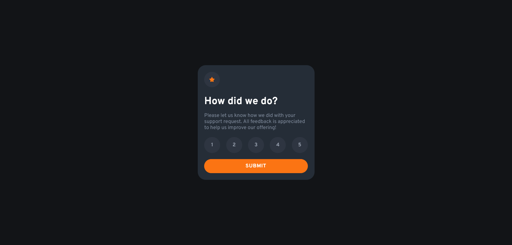

# Frontend Mentor - Interactive rating component solution

This is a solution to the [Interactive rating component challenge on Frontend Mentor](https://www.frontendmentor.io/challenges/interactive-rating-component-koxpeBUmI). Frontend Mentor challenges help you improve your coding skills by building realistic projects.

## Table of contents

- [Overview](#overview)
  - [The challenge](#the-challenge)
  - [Screenshot](#screenshot)
  - [Links](#links)
- [My process](#my-process)
  - [Built with](#built-with)
  - [What I learned](#what-i-learned)
  - [Useful resources](#useful-resources)
- [Author](#author)

## Overview

### The challenge

Users should be able to:

- View the optimal layout for the app depending on their device's screen size
- See hover states for all interactive elements on the page
- Select and submit a number rating
- See the "Thank you" card state after submitting a rating

### Screenshot



### Links

- Repo: [Github](https://github.com/basit-korai/feedback)
- Live Site: [Click me](https://basit-korai.github.io/feedback/)

## My process

### Built with

- Semantic HTML5 markup
- CSS custom properties
- Flexbox
- CSS Grid
- Mobile-first workflow
- Sass


### What I learned
``` setTimeout(() => {location.reload();}, 1000); ```

- I learned that I could run some piece of code after some seconds.
      
### Useful resources
- [W3Schools](https://www.w3schools.com/)
- [MDN](https://developer.mozilla.org/en-US/)
- [StackOverflow](https://stackoverflow.com)
- Try to learn as much as you can from these resources to escape from **Tutorial Hell**.

## Author
- Basit Korai - a self-taught Full Stack Developer.
- Frontend Mentor - [@basit-flash](https://www.frontendmentor.io/profile/basit-flash)
- Github - [@basit-korai](https://github.com/basit-korai)